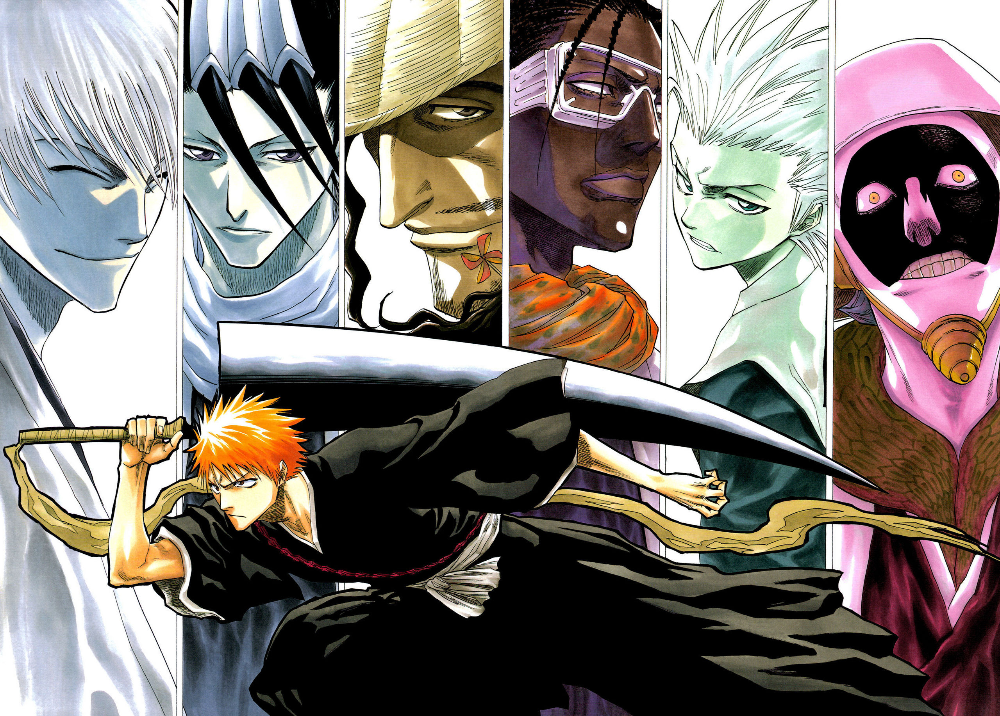

# Trabajo final: Bleach Guesser

__Autores: Alejandro Tomás Pacheco Rodríguez, Melissa Ruiz González, Pedro Martín Escuela__

    

## Índice

- [Introducción](#intro)

- [Diseño Previo](#diseño)

### Introducción 

En este repositorio realizaremos el trabajo final para la asignatura de __Desarrollo de Interfaces (DAD)__. La temática del trabajo será el anime _Bleach_. Se realizará un _guesser_ de los personajes. Se irán mostrando __imágenes aleatorias__ de dichos personajes y se deberá acertar cual es.

### Diseño Previo 