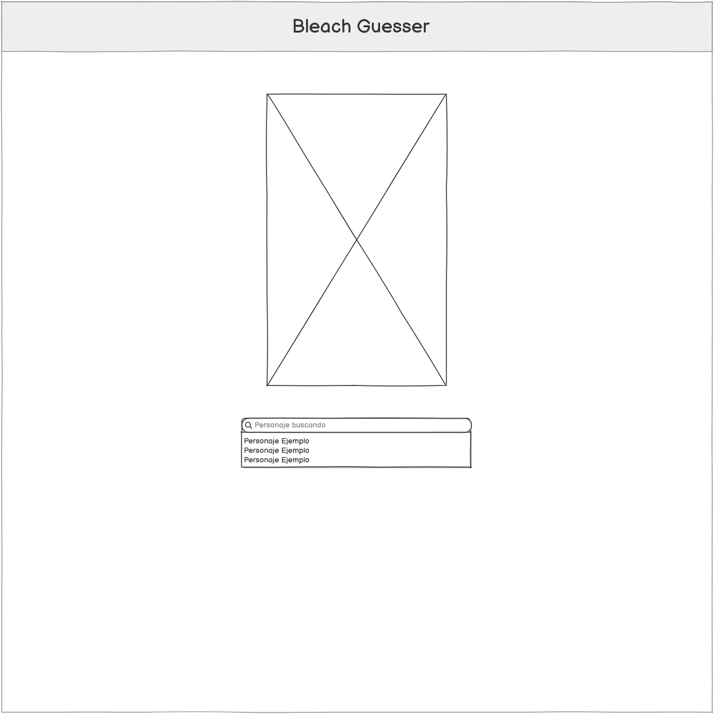
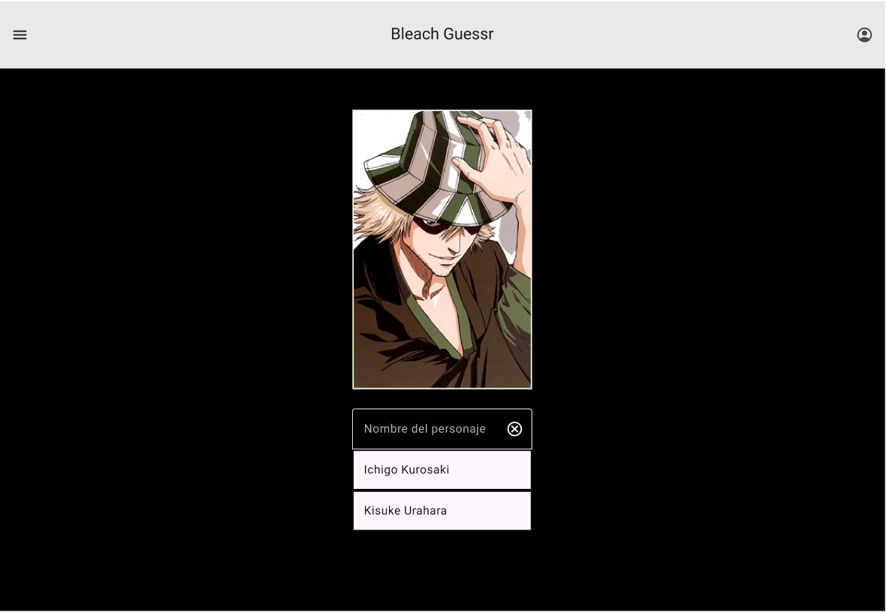
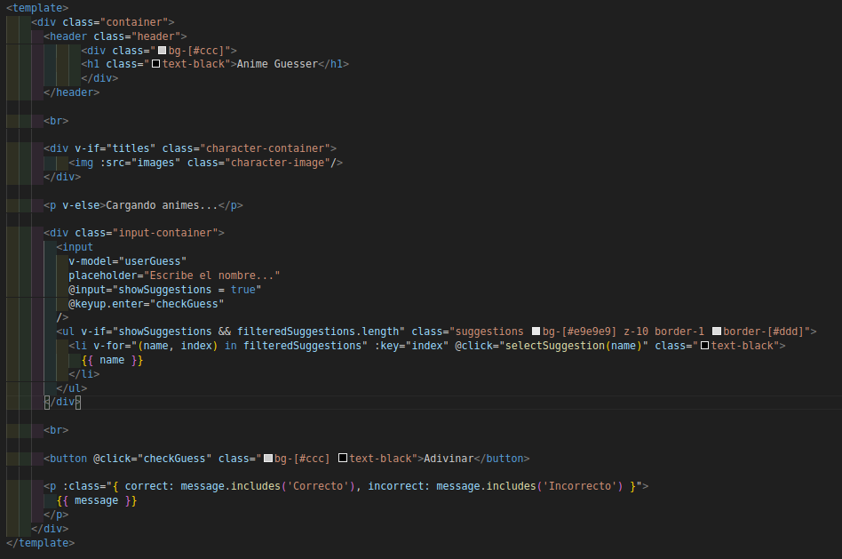
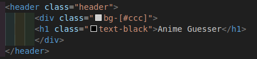
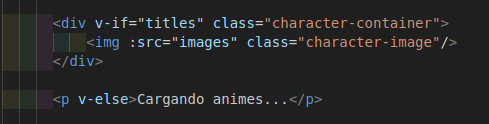
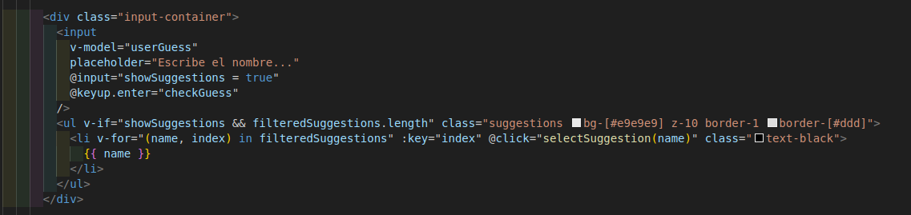
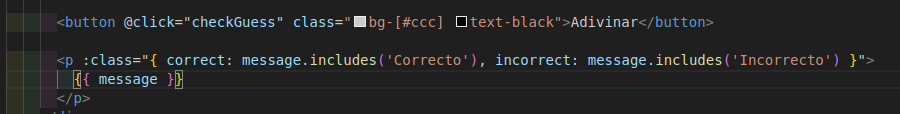

# Trabajo final: Bleach Guesser

__Autores: Alejandro Tomás Pacheco Rodríguez, Melissa Ruiz González, Pedro Martín Escuela__

    

## Índice

- [Introducción](#intro)

- [Diseño Previo](#diseño)

    - [Wireframe]()

    - [Mockup]()

- [Pasos del codigo](#code)

### Introducción 

En este repositorio realizaremos el trabajo final para la asignatura de __Desarrollo de Interfaces (DAD)__. La temática del trabajo será un guesser de anime. Se irán mostrando __imágenes aleatorias__ de las carteleras y se deberá acertar que anime es.

### Diseño Previo 

Nuestro concepto inicial era hacerlo unicamente de personajes de _Bleach_, pero más adelante decidimos modificarlo a __animes__ en general.

El __primer diseño__ de la aplicación que hicimos fue el siguiente wireframe:

    

Y el mockup:

    

Podemos ver una imagen que muestra el __personaje a acertar__. Al empezar a introducir un _nombre_, mostrará la lista de nombres que __coinciden con lo introducido__ y se podrá seleccionar la opción que se desee. Como el concepto se cambió a acertar el anime, se muestran imagenes de la cartelera y no de personajes, pero mantuvimos el formato de __imagen-input-opciones__.

### Codigo 

En `App.vue` cargamos el componente principal. En el, tenemos realizada toda la lógica del guesser. Más adelante crearemos un home donde se pueda [elegir las diferentes versiones del juego](). 

    

En el componente lo que se carga siempre es un encabezado con el titulo, un `v-if/else` para mostrar la imagen solo cuando esté cargada, si no lo está, mostrará _Cargando animes..._

    

    

Debajo de la imagen tenemos el __input__ que muestra las opciones parecidas a lo introducido para que puedas marcarlo desde ahí.

    

Y por ultimo un botón para __adivinar__ y un `
` que muestra el __resultado__. Si has acertado, muestra que es correcto y se __cambia el anime__ a otro para seguir jugando.

    

### Lógica 

El funcionamiento de los juegos va a ser el __mismo__ en general. Lo unico que se modificará será el __endpoint de la api__, para obtener los __elementos que queramos__.